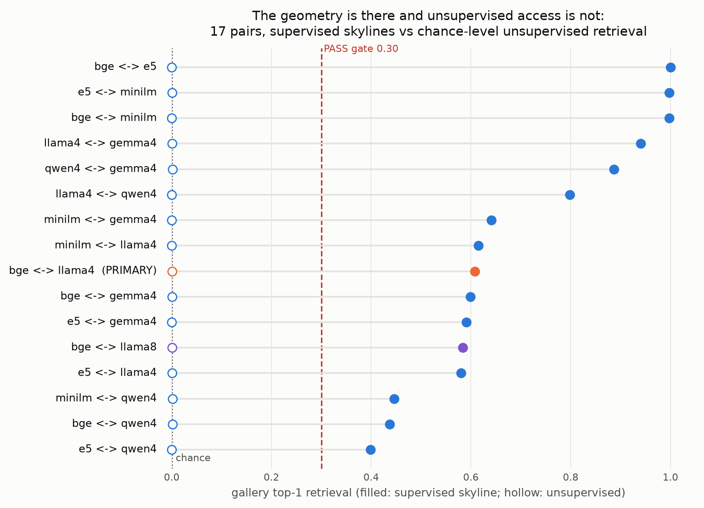
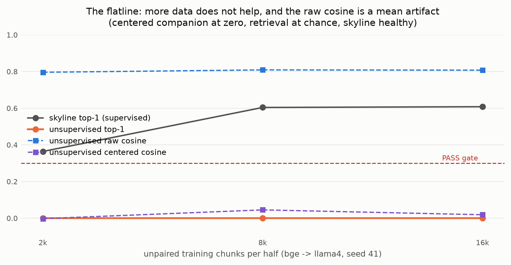

# AN2B Labs Technical Report #002r
## Platonic Convergence at Desk Scale: The Geometry Is There, and Unsupervised Access Is Not

**J. DeVere Cooley, AN2B Labs**
**Status: v1.0, published 2026-09-08 on the PI's word (D20); status line corrected 2026-09-11, the ratification having been recorded in the decision log and commit 8d6665d but not here**
**Pre-registration: original TR-002 at commit `7b7262d` (2026-08-24); rescoped protocol TR-002r frozen at `11b914d` (2026-09-03) through the kickoff gate under FRONTIER-001, the lab's first radar-driven rescope**

---

## Abstract

vec2vec and mini-vec2vec demonstrated at full scale that text
embedding spaces can be translated into one another without paired
data — the strong Platonic Representation Hypothesis, made
constructive. TR-002r asked whether those claims survive desk scale:
4-bit quantized small models, tens of thousands of training samples,
consumer hardware. The verdict is **FAIL**, in exactly the
pre-registered H0 shape: unsupervised translation collapses while
supervised alignment demonstrably works. Across 17 pairs drawn from
seven embedding spaces (three sentence encoders, three 4-bit decoder
LLMs, one 8-bit precision arm), every unsupervised run retrieves at
chance (top-1 0.000-0.003 against 0.001 chance and a 0.30 gate),
flat across the corpus-size grid, both directions of the frozen
primary pair, both seeds. Meanwhile the supervised skylines clear
their 0.80 floor on 15 of 17 pairs — decoder-to-decoder pairs align
BEST (llama-gemma: cosine 0.95, retrieval 0.94) — so the shared
geometry the hypothesis predicts is measurably present; what fails
is unsupervised access to it in this regime. Two artifacts were
caught and disarmed along the way: raw cosine up to 0.86 with zero
retrieval, unmasked as pure mean-vector inflation by the
pre-registered centered companion; and a certification exam that
refuted five translator implementations, including scipy's QAP
solver inside the faithful published pipeline, before certifying the
sixth. The desk-scale verification niche the radar identified now
has its first result, and it is a boundary: the universal-geometry
claims do not extend, as published methods stand, to quantized
small-model spaces trained on single-register corpora at n <= 16k.
Everything ran on two Apple Silicon machines at $0.

## 1. Hypothesis

**H1:** unsupervised vec2vec-class translation achieves usable
fidelity on the frozen primary pair (bge-small <-> Llama-3.1-8B-4bit,
the most architecturally distant pairing) at the largest
pre-registered n: raw cosine >= 0.70 AND top-1 >= 0.30 in a
1,000-document gallery, both directions, both seeds, with the
supervised skyline >= 0.80 certifying the instruments. **H0:** the
universal-geometry claim does not survive quantization and small n;
unsupervised translation collapses even where supervised alignment
succeeds. KILL: the skyline itself fails on most pairs.

## 2. Method

The protocol was rescoped through the kickoff gate on FRONTIER-001's
finding that the existence question was answered at macro scale;
the reviewer's stamp added three amendments (one pair one gate; the
wrong-model control; frozen method class). Eighteen decisions
(D1-D18) logged before the numbers each could bend, including the
mid-flight contingencies: a pre-authorized fallback to a 16k largest
grid point when an MLX stall recurred (D10/D15), and a frame
resolution when the smoke test caught the cosine bars' unnamed frame
(D14/D17: raw frame per the PI's ruling, centered companions beside
every number).

Corpus: 154 public-domain works plus a non-fiction OOD shelf,
200-word chunks, training halves disjoint BY WORK with global
dedup before assignment (47.6k/48.6k chunks), a 1,000-chunk gallery
and 1,269 paired anchors from held-out works. Spaces: bge-small,
e5-small, MiniLM; Llama-3.1-8B-4bit (pinned), Qwen3-1.7B-4bit
(pinned), gemma-2-9b-4bit; Llama-3.1-8B-8bit as the precision arm.

**The translator earned certification before touching data**, and
the exam is half the story: it refuted five implementations —
three reconstructions from memory, then the faithful published
mini-vec2vec pipeline whose scipy FAQ solver returned matching
objectives of 38-51 against a known-true 72.45, on an instance where
k-means had recovered both halves' clusters perfectly — before
certifying the published pipeline with a seeded greedy structural
matcher substituted (top-1 1.000 on the recoverable world, 0.004 on
the no-structure world). Three exam-world corrections along the way
became a pre-registered precondition list for the method class:
identifiable spectrum, non-gaussian moments, multi-modal cluster
structure — with the mechanistic prediction, logged before any real
number, that clouds lacking cluster structure fail at the anchoring
stage.

## 3. Results

*Figure 1. The census. Filled dots: supervised skyline retrieval per
pair; hollow dots: unsupervised retrieval, at chance on all 17
pairs. Encoder-encoder skylines sit at ~1.0, decoder-decoder at
0.80-0.94, encoder-decoder at 0.40-0.64. The gap between the columns
is the verdict.*

| Gate clause (frozen) | Measured | Leg |
|---|---|---|
| Primary top-1 >= 0.30, both directions | 0.001 / 0.000 | **red** |
| Primary raw cosine >= 0.70, both directions | 0.807 / 0.666 | **red** (one direction) |
| Skyline >= 0.80 on the primary | 0.839 (weaker direction) | green |
| Seeds replicate | identical clause outcomes | green |
| KILL: skyline < 0.80 on most pairs | 2 of 17 below | **did not fire** |

The unsupervised collapse is total and structured: retrieval at
chance on every pair including bge<->e5 (two BERT-family encoders
whose skyline retrieves perfectly), flat across n in {2k, 8k, 16k},
invariant to precision (the 8-bit arm reads the same as 4-bit). The
raw-cosine column deserves its own sentence: values up to 0.86 with
zero retrieval, and centered companions at ~0.00 throughout — the
restored mean vector accounts for essentially all of the raw cosine,
which is the concrete desk-scale demonstration of why cosine-only
replication claims in this literature should not be believed without
a retrieval column beside them.

*Figure 2. The primary pair across the n grid: unsupervised
retrieval flat at chance, raw cosine flat at 0.80 (the mean
artifact), centered cosine at zero, skyline healthy above.*

**The skyline census is the positive finding inside the FAIL.** The
shared geometry is present and supervised alignment finds it
everywhere: encoder-encoder pairs at ~1.0 retrieval, and
decoder-decoder pairs (llama<->gemma 0.94, llama<->qwen 0.80,
qwen<->gemma 0.89) aligning better than any encoder-decoder pair
(0.40-0.64). Convergence at desk scale is real, class-stratified,
and strongest within the decoder family — a texture the macro-scale
literature has not reported.

## 4. Controls

- **Shuffled target: clean.** Coordinate-permuted target space
  yields top-1 0.004, within noise of chance.
- **Wrong-model: fired degenerately, reported as such.** With the
  genuine pair itself at chance, the control's ratio clause had
  nothing to test (0.0 against a bound of 0.1 x 0.001); a control
  that presupposes a working translation is vacuous under total
  collapse. The checker records the violation; the mechanism is
  stated rather than excused.
- **Disjointness: structural zeros** (whole-work assignment, global
  dedup before splitting).
- **Domain shift (reported):** OOD probes through the primary
  translator read the same chance-level retrieval as in-domain, a
  collapse with nothing left to degrade.

## 5. Findings

1. **A precisely posed boundary for the strong PRH literature**: the
   published unsupervised-translation claims do not extend, as the
   methods stand, to 4-bit small-model spaces on single-register
   corpora at n <= 16k, even between near-twin encoders, while
   paired-anchor alignment works throughout. Replication at desk
   scale fails at stage one: the anchoring structure the methods
   feed on is not there to find.
2. **The centered-companion rule is mandatory equipment** for any
   embedding-translation claim: raw cosine 0.86 with zero retrieval
   is a mean artifact this report manufactures and unmasks in the
   same table.
3. **Convergence is class-stratified at desk scale**: decoder-decoder
   geometry aligns best, encoder-decoder worst, with quantization
   (4-bit vs 8-bit) making no measurable difference — corpus and
   class, not precision, are the binding constraints here.
4. **The certification-exam pattern generalizes**: it caught a
   published pipeline's solver returning objectives far below a
   known-true optimum, and its world corrections read out the method
   class's preconditions before a single real embedding was spent.

## 6. Verdict

**FAIL**, per the frozen criteria, in the pre-registered H0 shape:
the primary pair misses the gate (retrieval at chance, one direction
also under the cosine bar) while the skyline passes on 15 of 17
pairs. The KILL did not fire: the instruments see alignment; the
unsupervised method does not. Verify runs instrument legs green
(19/19 checker exams, translator certification, corpus gate) and the
PASS legs red for measured reasons, exit nonzero as built.

## 7. Limitations

- One unsupervised method class was tested, as frozen: mini-vec2vec-
  style linear alignment (the adversarial secondary was not run;
  compute went to the boundary map). A stronger optimizer might
  cross the boundary; the boundary is stated for the method as
  published.
- The corpus is single-register fiction, deliberately within the
  method's stated cluster-anchoring assumptions at the topic level
  but plausibly weaker in cluster structure than web-scale text;
  the D12 precondition prediction anticipated exactly this failure
  mode, and corpus-structure sensitivity is the sharpest follow-up.
- The 16k grid ceiling is the D10/D15 fallback, pre-authorized when
  hardware stalls recurred; published methods used ~60k+ samples,
  so n remains a live variable ABOVE this experiment's range.
- The frame resolution (D14/D17) was made mid-experiment by the PI
  before any gate number existed; both frames are reported
  throughout, and top-1, which is frame-robust, decides the verdict
  regardless.
- Skyline retrieval on encoder-decoder pairs (~0.6) bounds what any
  unsupervised method could have achieved there; the encoder-encoder
  pairs (skyline ~1.0) carry the cleanest version of the negative.

## 8. Reproducibility

Public repository: github.com/jcools1977/an2b-labs, `tr002r/`.
Decision log D1-D18 plus closeout; corpus manifest and per-space
embedding hash sidecars committed; every grid run in
results/grid.jsonl with both frames; verify.sh end to end. Both
forecasts sealed against the frozen protocol before Phase 0 closed.
Hardware: one M-series laptop, one 16 GB Mac mini (which ran warm).
Incremental cost: $0. Wall-clock: four days, two of them hardware
stalls now documented in the log.
