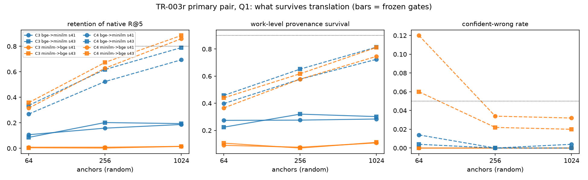
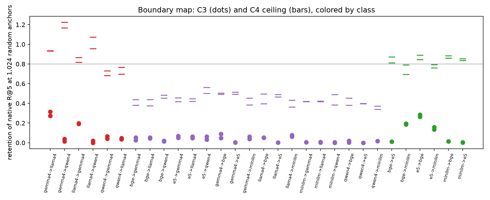

# AN2B Labs Technical Report #003r
## What Survives Translation: A Memory Store Crossing Embedding Models Keeps Its Ceiling and Loses Its Zero-Fit Floor

**J. DeVere Cooley, AN2B Labs**
**Status: v1.0, published 2026-09-11 on the PI's word (D20); ledger at an2b.com/labs**
**Pre-registration: original TR-003 at commit `7b7262d` (2026-08-24); rescoped protocol TR-003r frozen at `05d156e` (2026-09-08) through the kickoff gate under FRONTIER-002 (countersigned by the reviewer), stamped with three conditions; oracle of record sealed at `ca801ab`, three-seat panel sealed at `e4bdb00`, both before Phase 0 closed**

---

## Abstract

Zero-shot stitching of embedding spaces through shared anchors is
established in the literature, and TR-002r showed at desk scale that
paired-anchor alignment works where unsupervised alignment does not.
TR-003r asked what a MEMORY SYSTEM keeps and loses when a store
written in one embedding space is read from another: recall,
provenance, and the shape of its failures, as a function of anchor
count, on consumer hardware. The verdict is **FAIL**, in the
pre-registered H0 shape. On the frozen primary pair (bge-small and
MiniLM, the hardest encoder pair) zero-fit relative representations
at 1,024 random anchors retain 0.19 and 0.015 of native Recall@5 in
the two directions, keep work-level provenance on 0.29 and 0.11 of
their top hits, and replicate exactly across seeds, against frozen
bars of 0.80 and 0.90. The KILL did not fire: the paired-anchor
Procrustes ceiling on the same anchors retains 0.69 to 0.89, so the
instrument saw the translation and the method did not survive it.
Three things the controls and the boundary map added: the raw-vector
"floor" is not a floor for 384-dimensional BERT-family encoders
(0.17 to 0.54 cross-model recall with no transform at all);
scrambled nonsense anchors translate BETTER than real anchors
wherever that raw alignment exists (0.32 to 0.45 versus 0.19), so
the anchor coordinates carry shared coordinate geometry rather than
semantic alignment; and the fitted ceiling with only 64 anchors
returns wrong memories with native-grade confidence 9 to 30 percent
of the time, the memory-safety failure the confident-wrong clause was
written to catch, found in the ceiling rather than the method. The
class texture TR-002r measured replicates on a memory task:
decoder-decoder ceilings 0.84 to 0.93, encoder-decoder 0.40 to 0.53.
A reported diagnostic locates the loss: relative representations lose
22 to 44 percent of recall INSIDE a single model, in proportion to
its anisotropy, before any translation. Everything ran on two Apple
Silicon machines at $0 of compute; the three-vendor forecast panel,
sealed as the pilot's first live subject, cost $0.27.

## 1. Hypothesis

**H1:** a memory store written in one desk-scale embedding space and
read from another through relative representations against a shared
anchor set (cosines to anchor texts, no fitted transform) retains most
of its native recall and keeps its provenance intact at the largest
pre-registered anchor count, on the hardest encoder pair, in both
directions, at both seeds: retention >= 0.80 of native Recall@5,
work-level provenance survival >= 0.90, confident-wrong rate <= 0.05
absolute with the native baseline reported beside. **H0:** recall,
provenance, or failure safety degrades past the frozen bars even
where paired-anchor alignment demonstrably works. **KILL:** the
paired-anchor instrument itself retains under 0.50 of native recall.

## 2. Method

Six embedding spaces, all pinned and cached from TR-002r (three
sentence encoders: bge-small-en-v1.5, e5-small-v2, all-MiniLM-L6-v2;
three 4-bit decoders as mean-pooled embedders: Llama-3.1-8B-Instruct,
Qwen3-1.7B, gemma-2-9b-it). Per seed (41, 43): a 5,000-chunk store of
200-word public-domain chunks drawn as 250-chunk contiguous runs from
23 and 25 works, each chunk carrying its work and position with
sequence edges; 500 Q1 cued-recall queries (the middle 60 words of a
target chunk) and 500 Q2 neighbor queries (the first 60 words of the
following chunk; reported, never gated); an anchor pool of 2,048
chunks from works partitioned globally by hash so no seed's anchors
can touch any seed's queries; anchor draws at 64, 256, 1,024, random
(the gate) and k-means medoid (boundary map). Conditions per ordered
pair: C1 native, C2 raw vectors (a seeded random map only where
dimensions differ), C3 relative representations (the primary,
zero-fit), C4 paired-anchor orthogonal Procrustes (the TR-002r
ceiling instrument; rank rule D10). Thirty ordered pairs, 2,424 grid
configurations, every one in results/grid.jsonl.

Every instrument earned its post before touching data. The anchor
library's certification exam refuted its own first world (queries
drawn from outside the store; D11) before certifying nine of nine
legs including the red side (an unrelated world must sit at chance).
The end-to-end smoke test fires KILL on an unrecoverable world and
passes the gates on a recoverable one. Twenty-five checker fixtures
were rejected or accepted correctly before any store existed. The
first store build spanned six novels and was caught by code (D9).
Decisions D1 to D18 are logged before the numbers each could bend.

## 3. Results

*Figure 1. The primary pair, Q1, random anchors: retention,
provenance survival, and confident-wrong rate against anchor count,
C3 solid and the C4 ceiling dashed, both directions, both seeds. The
dotted lines are the frozen bars. C3 never approaches the bars; C4
climbs toward them and clears retention in one direction.*

| Gate clause (frozen) | bge->MiniLM (41 / 43) | MiniLM->bge (41 / 43) | Leg |
|---|---|---|---|
| (i) retention >= 0.80 | 0.187 / 0.194 | 0.015 / 0.015 | **red** |
| (ii) provenance >= 0.90 | 0.284 / 0.302 | 0.108 / 0.112 | **red** |
| (iii) confident-wrong <= 0.05 | 0.000 / 0.000 (native 0.002 / 0.000) | 0.000 / 0.000 (native 0.002 / 0.000) | green |
| Seeds replicate | identical clause outcomes | identical clause outcomes | green |
| KILL: C4 retention < 0.50 | 0.694 / 0.790 | 0.860 / 0.885 | did not fire |

Clause (iii) passes trivially: relative coordinates compress every
margin, so a wrong memory arrives without native-grade confidence.
The excess over the native baseline is -0.002 to 0.000 in every
cell. The anchor-count curves (Recall@5, mean of seeds) tell the
shape: C3 bge->MiniLM 0.094, 0.176, 0.186 at 64, 256, 1,024 anchors,
flattening well below the bar; C3 MiniLM->bge 0.006, 0.005, 0.014,
never leaving chance; C4 on the same anchors 0.30, 0.56, 0.73 and
0.31, 0.61, 0.81. Medoid anchors change C3 by at most 0.03 in either
direction. Ranking stability (Jaccard of the top-10 against native)
is 0.06 to 0.10 for C3 and 0.18 to 0.23 for C4 at 1,024 anchors: even
the ceiling reorders most of the list.

**Q2 neighbor recall** (reported): native recall of the memory that
PRECEDES a cue is hard even in one model (0.22 to 0.27 Recall@5).
Across models C3 keeps 0.22 and 0.02 of that, C4 0.56 and 0.69; C4
keeps work-level provenance on 0.91 and 0.79 of its top hits, C3 on
0.35 and 0.11.

*Figure 2. The boundary map at 1,024 random anchors, Q1: C3 (dots)
and the C4 ceiling (bars) per ordered pair, colored by class. Zero-fit
translation sits near the floor on every pair; the ceiling is
class-stratified exactly as TR-002r's skyline census was.*

**The boundary map.** Control 5 excludes two spaces from the map
with their numbers published: Qwen3-1.7B-4bit recalls its own
memories from a 60-word cue at 0.294 Recall@5 with a native
confident-wrong rate of 0.21, and Llama-3.1-8B-4bit at 0.847; both
are under the 0.90 floor (bge 0.932, e5 0.977, MiniLM 0.977,
gemma-2-9b 0.942 clear it). On the twelve retained ordered pairs:

| Class (retained) | C2 raw | C3 retention | C4 retention | scrambled C3 R@5 | C4 at 64 anchors, confident-wrong |
|---|---|---|---|---|---|
| encoder-encoder (6) | 0.35 | 0.11 | 0.83 | 0.21 | 0.09 |
| encoder-decoder, gemma (6) | 0.00 | 0.04 | 0.45 | 0.01 | 0.17 |

The excluded decoder rows read the same way (gemma<->Llama C4
retention 0.84 and 0.93, C3 0.19 and 0.29; every Qwen row is
dominated by Qwen's own floor, with C4 "retention" above 1.0 because
a store translated from gemma retrieves better than Qwen's native
store does). Full table in results/summary.json.

## 4. Controls, read literally

- **Control 4, disjointness:** structural zeros by code (store versus
  anchor pool, query sources versus pool, every seed's anchors versus
  every seed's queries).
- **Control 5, native floor:** both primary spaces clear 0.90; two
  decoders excluded as above.
- **Control 2, mismatched anchors (the house catcher):** C3 collapses
  to 0.000 Recall@5 and 0.000 retention at every anchor count, both
  directions, both seeds: the collapse the control demands. Its
  literal clause, "within 0.05 of C2," fails because C2 is not a
  floor on these pairs (raw 384-dimensional vectors from these three
  BERT-family encoders retrieve across models at 0.36 to 0.48 on the
  primary pair without any transform). The checker records the
  violation and the mechanism is stated rather than excused, the
  TR-002r wrong-model precedent in the other direction.
- **Control 1, scrambled anchors:** the same C2 degeneracy applies to
  the literal clause, and the substantive reading is worse for H1.
  Where the store is in bge or e5, scrambled nonsense anchors do NOT
  collapse C3 and outperform real anchors: 0.32 and 0.45 versus 0.19
  (bge->MiniLM, seeds 41 and 43); 0.49 and 0.55 versus 0.24 and 0.27
  (e5->bge). Where the store is in MiniLM, both collapse to chance.
  Across the map, scrambled-anchor retrieval tracks C2, not real C3:
  it is near zero wherever raw coordinates are unaligned. By the
  control's own text, the anchor coordinates carry gallery geometry,
  not semantic alignment.
- **Control 3, dimension-matched random projection:** random
  projections sit at 0.000 to 0.002. C3 exceeds them by 0.18 and 0.19
  (bge->MiniLM) against a 0.20 bar, and by 0.01 (MiniLM->bge). A
  near-miss is a FAIL: zero-fit relative representations barely beat
  noise on the primary pair.

## 5. Findings

1. **A memory store does not survive zero-fit translation at desk
   scale, even between near-twin encoders.** Relative representations
   against 1,024 shared anchors keep 19 percent of recall in one
   direction and 1.5 percent in the other, and provenance follows.
   The same store crosses the same pair at 69 to 89 percent through
   a Procrustes map fit on the same anchors: the ceiling is high and
   the zero-fit method does not reach it.
2. **The loss is in the coordinates, not the crossing.** Reported
   diagnostic (D15a): within a single model, relative representations
   retrieve 0.56 (bge), 0.78 (MiniLM), 0.72 (e5) at 1,024 anchors
   against natives above 0.92, in proportion to each space's mean
   pairwise cosine (0.64, 0.33, 0.83); anchor-mean centering does not
   help. Cosine-to-anchor coordinates in anisotropic sentence spaces
   are dominated by the common direction, and the cross-model loss
   sits on top of that.
3. **Scrambled anchors beat real anchors wherever raw coordinates
   already align.** Nonsense strings, embedded in both spaces, carry
   the shared coordinate structure that C2 also sees; real anchors
   add semantic content that the coordinates then flatten. The
   control designed to catch geometry masquerading as alignment
   caught it.
4. **The raw-vector floor is not a floor for BERT-family 384-d
   encoders.** bge, e5, and MiniLM retrieve across each other at 0.17
   to 0.54 Recall@5 with no transform, and near zero against any
   decoder space. Any cross-encoder translation claim on this family
   needs the raw baseline beside it, the way TR-002r's centered
   companion sits beside every cosine.
5. **The confident-wrong failure lives in the ceiling with few
   anchors.** C4 at 64 anchors returns wrong memories with
   native-grade confidence 9 percent of the time between encoders and
   17 to 30 percent to or from decoders, against native rates near
   zero. A memory system that fits its crossing on too few anchors
   fails the dangerous way; one that uses zero-fit coordinates fails
   the safe way (wrong memories arrive without confidence) and fails
   almost always.
6. **TR-002r's class texture replicates on a memory task.** The
   paired-anchor ceiling is 0.83 encoder-encoder, 0.84 to 0.93
   decoder-decoder (gemma and Llama), 0.40 to 0.53 encoder-decoder:
   the same ordering the skyline census gave, now measured as
   retention of a store's own recall.

## 6. Verdict

**FAIL**, per the frozen criteria, in the pre-registered H0 shape:
clauses (i) and (ii) miss in every cell, both directions, both seeds,
by wide margins; clause (iii) passes trivially; the KILL did not fire
(C4 retention 0.69 to 0.89, above 0.50). Controls 4 and 5 hold;
control 2's mechanism holds under a degenerate literal clause;
controls 1 and 3 are violated for measured reasons that are
themselves findings. verify.sh runs every instrument leg green
(25 checker fixtures, the anchor exam, the plumbing smoke, store
integrity) and the gate and control legs red, and exits nonzero as
built.

## 7. Limitations

- Queries are deterministic sub-spans of their targets (D5), which
  makes native cued recall lexically easy; the verdict is stated as
  RETENTION relative to native for exactly that reason, and Q2
  neighbor recall (0.22 to 0.27 native) shows what a harder cue does.
- The C4 ceiling uses PCA fit on the anchors alone (D10), rank-
  limited at 64 anchors; a reader that owned the store could fit a
  better ceiling. The KILL reads on this ceiling as frozen.
- Control clauses 1 and 2 were written against C2 as a floor; on
  BERT-family encoders it is not one. The violations are reported
  literally; a future protocol should reference the mismatched arm
  to a scrambled or random baseline rather than to C2.
- The relative-representation method is the plain Moschella form as
  frozen (cosines to raw anchors). Whitened or learned-anchor
  variants (arXiv:2605.30596) were not run and might cross the
  boundary; the boundary is stated for the method as pre-registered.
- Two decoder spaces fell under the native floor as mean-pooled
  4-bit embedders and are excluded from the map; their rows are
  published. Qwen3-1.7B at 0.29 is an embedding-quality result about
  mean pooling, not about translation.
- The single-register fiction corpus is inherited from TR-002r; the
  store spans 23 to 25 works per seed after the D9 cap.
- Training cutoffs in the forecast seals rest on the engines'
  self-report (gateway field null); the exposure stands in every seal
  record.

## 8. Reproducibility

Public repository: github.com/jcools1977/an2b-labs, `tr003r/`.
Decision log D1 to D18; store manifest with computed disjointness;
embedding hash sidecars for all six spaces; every configuration in
results/grid.jsonl; results/summary.json; verify.sh end to end.
Seeds 41 and 43. Hardware: one M-series laptop for analysis, one
16 GB Mac mini for extraction (the two 8B-class decoders took
thirteen hours swap-bound; D14). Incremental compute cost: $0. Panel
forecast cost at seal: $0.27. Wall-clock from stamp to verdict:
under twenty-four hours.

## 9. Forecasts, opened at closeout

Published verdict FAIL. Oracle of record (single seat, sealed
ca801ab): PASS 0.33 / FAIL 0.60 / SPLIT 0.02 / KILL 0.05, Brier
0.2718, modal FAIL. Panel (pilot's first live subject, sealed
e4bdb00): oracle-anthropic 0.3302, oracle-openai 0.0518, oracle-xai
0.2330, every seat modal FAIL; consensus (reported only) 0.1824;
always-FAIL baseline 0.0000, uniform 0.75. Full grading in
oracle/TR003r_scored.md. The reviewer's context-rich forecast seals
through their own channel and is scored when its plaintext is
relayed.
