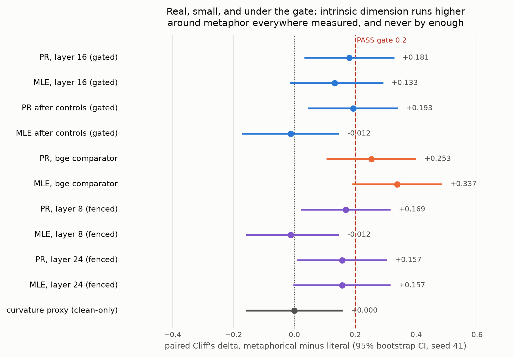
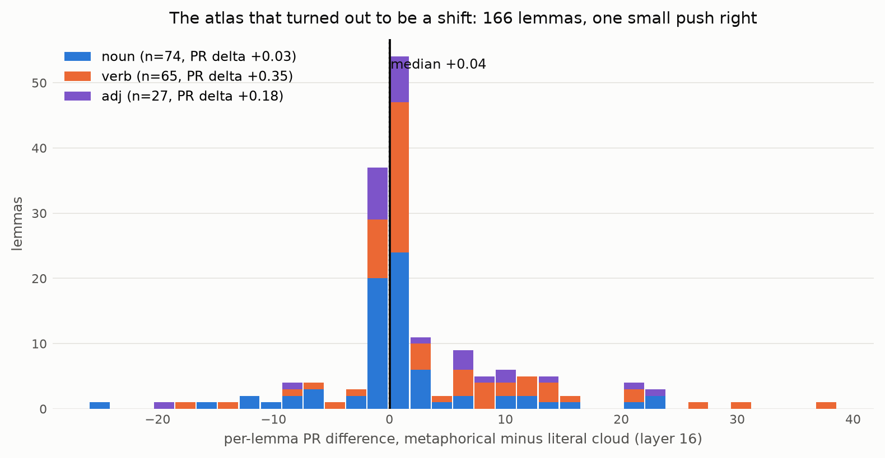

# AN2B Labs Technical Report #004
## Curvature of Meaning: Metaphor Raises Intrinsic Dimension, By Less Than We Demanded

**J. DeVere Cooley, AN2B Labs**
**Status: v1.0, published 2026-09-02; ledger at an2b.com/labs**
**Pre-registration: commit `7b7262d`, 2026-08-24, github.com/jcools1977/an2b-labs**

---

## Abstract

TR-004 asked whether figurative language occupies measurably
different geometry than literal language in embedding space: higher
local intrinsic dimension, higher curvature. The verdict is **FAIL by
near-miss**, and this time the near-miss is the finding. On 166 VUAMC
lemmas, each contributing equal-sized literal and metaphorical clouds
of contextual token states (within-lemma pairing, the tightest
identity-and-topic control any experiment in this program has had),
metaphorical clouds read HIGHER intrinsic dimension nearly everywhere
measured: paired Cliff's delta +0.181 (CI [0.036, 0.325]) under the
participation-ratio estimator, +0.193 after frequency and length
controls, direction agreed by both certified estimators, replicated
at both seeds, replicated in direction at layers 8 and 24, and
STRONGER in a second, architecturally unrelated embedder (+0.253 and
+0.337). Everything points the same way, and nothing reaches the
pre-registered 0.2 gate: the second estimator's CI includes zero, and
a near-miss is a FAIL. The curvature half of the hypothesis is simply
absent: the geodesic-vs-chordal proxy reads delta 0.000. The
experiment also earned its verdict twice before touching data: a
noise-condition exam decertified the Two-NN estimator for this regime
(it inverts dimensional order at realistic noise), and the paraphrase
of TR-015's lesson held in reverse, with the effect surviving the
removal of its most suspicious dimensions. Metaphor does something
small and real to embedding geometry; it does not do what the
protocol required. Everything ran on two Apple Silicon machines at $0.

## 1. Hypothesis

**H1:** local intrinsic dimension and curvature proxies around
metaphorical usages are significantly higher than around literal
usages of the same target words: both LID estimators agreeing in
direction, paired Cliff's delta >= 0.2 with CI excluding zero,
surviving frequency/length controls. **H0:** no consistent geometric
difference. KILL: an effect present in one embedding model and absent
in the other is a model artifact.

## 2. Method

Twenty decisions (D1-D20) logged before the numbers each could bend.
Corpus: VUAMC (MIPVU annotations), instance rules frozen at
acquisition (D15): clean metaphor-related words only, hedged
categories excluded from both sides, lexical verbs/nouns/adjectives,
lemmas surviving with >= 10 instances per side, both sides subsampled
to equal n (LID estimators are n-sensitive; unequal clouds would bias
the pair). 166 lemmas survived (74 noun, 65 verb, 27 adj; 7,274
instances). Embeddings (D3, frozen before extraction): Llama-3.1-8B
pinned snapshot, layer-16 token states, unnormalized (normalization
projects onto a sphere and installs the very curvature under
measurement); layers 8/24 pre-registered as fenced secondary reads;
bge-small token states as the KILL comparator.

**The estimators earned certification before touching data**, through
a synthetic-manifold exam with a noise condition (D5, D11): known
dimension recovered within 20%, order preserved at our cloud scale,
clean and under SNR 5:1 ambient noise. The exam did its job: Two-NN
INVERTS dimensional order under noise at n=40 (it reads at the
first-neighbor scale, where realistic noise lives) and was decertified
by adjudication (D14, D18), replaced by the participation ratio,
which passed every leg. Levina-Bickel MLE passed every leg including
noise. The geodesic-chordal curvature proxy was certified on
separation only, clean-regime only. The covariate residualizer passed
its own bite-proof (D7/D17), which caught the intercept trap (naive
full-OLS subtraction eats the paired effect itself) before it could
silently guarantee a FAIL.

## 3. Results

*Figure 1. Every Cliff's delta the experiment read. Blue: the gated
layer-16 legs. Orange: the bge comparator. Purple: the fenced depth
reads. Everything except MLE-after-controls sits right of zero;
nothing gated crosses 0.2.*

| Reading | delta | 95% CI |
|---|---|---|
| PR, layer 16 (gated) | +0.181 | [0.036, 0.325] |
| MLE, layer 16 (gated) | +0.133 | [-0.012, 0.289] |
| PR after controls (gated) | +0.193 | [0.048, 0.337] |
| MLE after controls (gated) | -0.012 | [-0.169, 0.145] |
| PR / MLE, bge comparator | +0.253 / +0.337 | both exclude zero |
| PR, layers 8 / 24 (fenced) | +0.169 / +0.157 | exclude zero |
| Curvature proxy (clean-only scope) | 0.000 | [-0.157, 0.157] |

The direction is everywhere; the magnitude is nowhere sufficient. The
frozen gate demanded BOTH estimators at >= 0.2 with CIs excluding
zero, raw and after controls. PR misses the threshold by 0.02-0.007;
MLE misses the CI requirement entirely and loses its point estimate
under residualization. Seeds replicate.

**One line this report holds firmly: the gate was a materiality
claim, not an existence claim, and the FAIL is about materiality.**
What the data show is an existence result: direction positive
everywhere measured, under the tightest identity-and-topic control in
the program, stronger in the unrelated embedder, surviving its
controls, at a magnitude below the pre-registered bar. Not a moral
PASS, and not a rounding tragedy: a real +0.18 that a dozen venues
would headline and this lab will not, which is the entire epistemic
claim. The correct next move belongs to replication, not grievance:
the magnitude question is now precisely posed (more lemmas, bigger
clouds, other model families), and the frozen 0.2 stands as what
materiality means here. Per-POS (reported, never
gated): the estimators disagree about where the effect lives, PR
finding it in verbs (+0.354), MLE in nouns (+0.216), a caution flag
for any study that picks one estimator and one POS.

**The KILL could not fire**, and the reason strengthens the residue:
the bge comparator shows the effect at +0.253/+0.337, stronger than
the model that carried the gates. Whatever this small elevation is,
it is not a Llama artifact.

*Figure 2. The per-lemma differences themselves: a heavy centered
mass and a right-leaning tail. The protocol hoped for an atlas; the
data supplied a shift.*

## 4. Controls

- **Label shuffle: clean** (+0.012 / -0.084, CIs include zero).
- **Synonym control: flagged, mechanism identified.** Literal-vs-
  literal frequency-matched pairs read -0.133 (point beyond the 0.1
  bound; CI includes zero). Cross-lemma pairs have UNEQUAL cloud
  sizes, and PR is n-sensitive; the main analysis is immune by
  construction (equal-n within-lemma pairs, D15). Reported as a
  pipeline caveat with its mechanism, not excused.
- **Random subspace and rogue dimensions: violations fire through
  the pre-registered strictest reading, and per-estimator numbers
  say something gentler.** The D18 rule compares every projected
  delta against the WEAKER estimator's baseline; per estimator, no
  projection strengthens its own effect (PR 0.193 vs 0.181), and
  removing the top-3/top-10 highest-variance dimensions leaves
  +0.169, most of the effect, with CI excluding zero. The rogue
  checker demands gate-level survival of an effect that was never
  gate-level; it fires the way TR-015's KILL fired, trivially, by
  the same death as the gate. The effect did not die with its rogue
  dimensions; it was born too small.

## 5. Findings

1. **A real, small, cross-model geometric signature of metaphor.**
   Within-lemma pairing controls identity and topic better than any
   prior TR could, and the intrinsic-dimension elevation survives
   frequency/length residualization, rogue-dimension removal, depth
   change, and an architecture change. Anyone claiming metaphor is
   geometrically invisible must explain this; anyone claiming it is
   a strong signal must explain the gate.
2. **The noise exam is mandatory equipment for LID work.** Two-NN,
   the field's default, inverts dimensional ORDER at realistic noise
   and cloud size. Any small-sample LID claim built on it should
   show its noisy-exam pass.
3. **Estimator disagreement is a result, not a nuisance**: two
   certified estimators locate the effect in different POS classes.
4. **No curvature.** The bending half of the hypothesis found
   nothing at all: delta 0.000, stated plainly.

## 6. Verdict

**FAIL**, per the frozen criteria: neither estimator clears 0.2 on
CI-excluding-zero terms raw AND after controls (a near-miss is a
FAIL), MLE loses its point under residualization, and the curvature
leg is null. The KILL did not fire. Verify runs instrument legs green
(18/18 checker exams, estimator certification with the noise
condition, residualizer bite-proof, corpus gate) and gate legs red
for measured reasons, exit nonzero as built.

## 7. Limitations

- The 0.2 gate was frozen against a paired Cliff's delta; the
  measured +0.18 with CI excluding zero would headline many papers.
  It does not headline this one, and that asymmetry is the program's
  entire epistemic claim.
- One noise operationalization (isotropic, SNR 5:1) certified the
  instruments; hidden-state noise is not isotropic.
- The synonym control's unequal-n mechanism is identified but not
  re-run equal-n; that re-run is the obvious robustness follow-up.
- VUAMC is one corpus, one annotation scheme (MIPVU), English only.
- The curvature proxy is certified clean-regime only; a
  noise-certified curvature instrument does not currently exist in
  this lab.

## 8. Reproducibility

Public repository: github.com/jcools1977/an2b-labs, `tr004/`.
Decision log D1-D20 plus the closeout entries; corpus manifest and
embedding sidecar hashes committed; VUAMC re-downloadable from the
Oxford Text Archive; all gate files and verify.sh committed. The
oracle ledger holds a protocol-only forecast sealed before Phase 0
and a context-rich reviewer forecast sealed before the gates, both
scored at closeout. Hardware: one M-series laptop, one 16 GB Mac
mini. Incremental cost: $0. Wall-clock: two attended days.
