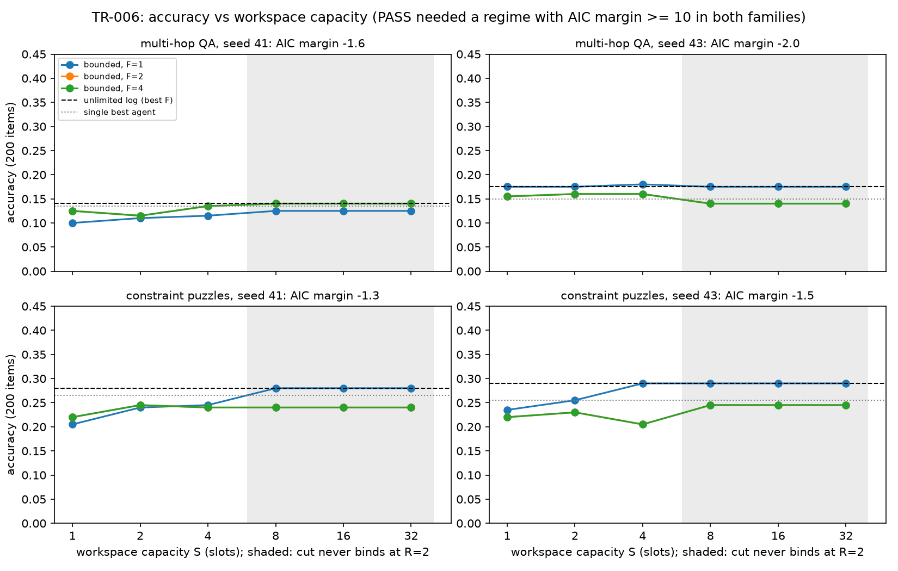
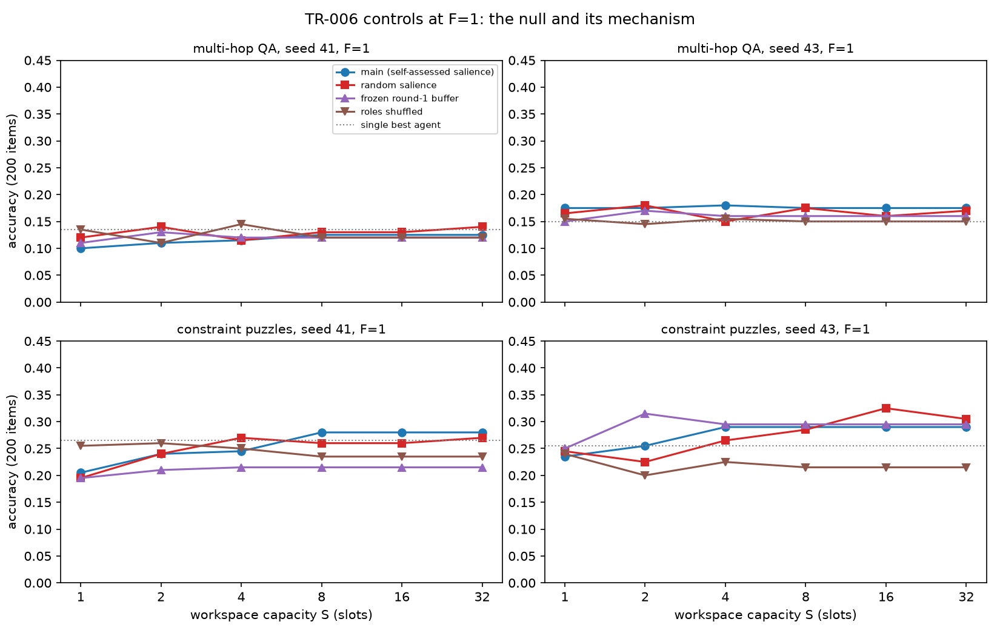

# AN2B Labs Technical Report #006
## Minimum Viable Workspace: A Bounded Broadcast Buffer Is a Scratchpad, Not a Bottleneck, at Desk Scale

**J. DeVere Cooley, AN2B Labs**
**Status: v1.0, published 2026-09-27 on the PI's standing word (D22); ledger at an2b.com/labs**
**Pre-registration: TR-006 frozen 2026-08-24 at `7b7262d`, unchanged; Phase 0 closed 2026-09-09 with the oracle of record sealed at `0f475c0` and the three-seat panel at `374e721`; design constants (R = 2, one model resident) fixed in the decision log before any counted data**

---

## Abstract

Global Workspace Theory's structural claim is that a limited-capacity
broadcast bottleneck does computational work: competition for scarce
slots, not sharing as such, produces integration. TR-006 asked whether
a small council of local models shows that signature. Three 7B-class
models (Llama-3.1-8B, Qwen3-8B, gemma-2-9b, all 4-bit) in fixed roles
shared a buffer of S slots, submitting items with self-assessed
salience, the top S surviving and broadcast every F rounds, across S
in {1, 2, 4, 8, 16, 32} and F in {1, 2, 4}, on 200 screened items per
configuration in two task families (multi-hop QA and constraint
puzzles), two seeds, with single-agent and unlimited-log baselines and
three negative controls: 168 configurations, 384 hours on one 16 GB
Mac mini. The verdict is **FAIL**, in the pre-registered H0 shape,
identically at both seeds. Accuracy against capacity is flat to within
two or three points in every family and seed (QA 0.11 to 0.17,
puzzles 0.22 to 0.26), the regime model loses to a smooth monotone fit
by 1.3 to 2.0 AIC in every cell against a required margin of +10, the
unlimited log ties or beats the best bounded configuration in three of
four cells and trails by half a point in the fourth, and the best
single model sits within one to three points of the best council. The
KILL did not fire. The controls locate the null: the frozen round-1
buffer sits at single-agent level in three of four cells and above
the live council in the fourth; shuffling roles changes nothing on QA
(the specialization claim is withdrawn there) and costs four to seven
points on puzzles; random salience is indistinguishable from
self-assessed salience. One structural fact the traces exposed and
this report states plainly: with three seats submitting one item per
round and R = 2 rounds, at most six items ever compete, so the cut
never binds at S >= 8 and those configurations are the unlimited log
by construction. The effective capacity sweep was S in {1, 2, 4}
against unbounded, and the workspace was a scratchpad at every point
of it. Everything ran at $0 of compute; the panel's forecasts cost
$0.09 at seal.

## 1. Hypothesis

**H1:** task performance as a function of workspace capacity shows a
non-linear regime change: below a critical capacity the council
performs at single-model level; above it, performance jumps rather
than climbs smoothly. **H0:** performance is monotonic and smooth in
capacity; the workspace is a bigger scratchpad. **PASS** (frozen): a
piecewise regime model beats a smooth monotone fit by AIC >= 10 on
both task families, and the unlimited-log baseline underperforms the
best bounded configuration. **FAIL:** the smooth fit wins, or the
unlimited log is best. **KILL:** regime location not stable across
the two families.

## 2. Method

Seats and buffer per the protocol, with the operational constants
logged before data (D11, D12, D20): greedy decoding, 200 tokens per
submission, Qwen3 thinking disabled; proposer Llama, critic Qwen3,
synthesizer gemma; JSON submissions carrying an item, a 0 to 100
salience and a current answer; candidates = survivors plus the round's
three submissions, top S by salience, broadcast on rounds that are
multiples of F, a final broadcast always, and the synthesizer's answer
in a separate final step so every F contains at least one exchange.
R = 2 rounds (D20; the frequencies stay distinct; less exchange is the
harder reading for H1). Tasks (D10): HotpotQA distractor validation
(the two gold paragraphs plus four seeded distractors, normalized exact
match) and seeded logic-grid puzzles with a solver proving a unique
solution; an item was scored only if at most one of the three models
answered it correctly alone; 200 per family per seed, disjoint across
seeds by hash. The regime test (D8): pooled over F within a family,
logistic-in-log2(S) smooth fit with non-negative slope against a step
model with a jump at a grid midpoint, binomial likelihoods, AIC with
the breakpoint counted as a parameter; certified on synthetic step,
logistic and flat worlds before data. Controls (D9): random salience,
frozen round-1 buffer, roles shuffled per item, each with a red
fixture before the mechanism existed; 19 checker fixtures, a
token-for-token certified fix for batched gemma-2 attention, and a
plumbing smoke that fires KILL on an unrecoverable synthetic world.
Twenty-three decisions logged; two of them (D16, D18) record the
builder's own faults and the corrected rules. Execution: legion, one
model resident at a time, batch 8 with out-of-memory halving,
supervised, never restarted in 384 hours.

## 3. Results

*Figure 1. Accuracy against workspace capacity, one line per broadcast
frequency, both families, both seeds. Dashed: the unlimited log at
its best frequency; dotted: the best single agent. Shaded: capacities
at which the cut never binds under R = 2 (identical to the unlimited
log by construction, and measured identical).*

| Gate clause (frozen) | QA, 41 | QA, 43 | Puzzles, 41 | Puzzles, 43 | Leg |
|---|---|---|---|---|---|
| Regime beats smooth by AIC >= 10 | -1.6 | -2.0 | -1.3 | -1.5 | **red** |
| Unlimited log < best bounded | 0.140 vs 0.140 | 0.175 vs 0.180 | 0.280 vs 0.280 | 0.290 vs 0.290 | **red** (3 of 4 cells) |
| Seeds replicate | identical clause outcomes | | | | green |
| KILL: breakpoints > 1 step apart where both families show a regime | no regime in any family | | | | did not fire |

Accuracy by capacity, averaged over frequency (QA then puzzles):
seed 41 reads 0.117, 0.113, 0.128, 0.135, 0.135, 0.135 and 0.215,
0.243, 0.242, 0.253, 0.253, 0.253; seed 43 reads 0.162, 0.165, 0.167,
0.152, 0.152, 0.152 and 0.225, 0.238, 0.233, 0.260, 0.260, 0.260. The
fitted "breakpoints" (S = 4 and 2 on seed 41, 2 and 8 on seed 43)
sit on steps of one to three accuracy points, inside a binomial
standard error of about three points at n = 200, and the smooth fit
wins in every cell. Best single agents: 0.135 and 0.265 (seed 41),
0.150 and 0.255 (seed 43), against best councils of 0.140, 0.280,
0.180, 0.290. Frequency mattered as much as capacity: on puzzles the
unlimited log reads 0.28 at F = 1 and 0.24 at F = 2 and 4, so more
exchanges helped and more slots did not.

**The cut never binds above S = 4.** The slot-competition statistic
(final-broadcast items that held the last slot at their cut) is 1.0
at S in {1, 2, 4} and exactly 0 at S in {8, 16, 32} in every cell,
because three seats over two rounds produce at most six candidates.
Those configurations are the unlimited log at the same F, and the
grid confirms it: their accuracies are identical to the unlimited
log's, cell for cell, which is also a determinism check on the whole
harness (greedy decoding, identical prompts, identical outputs).

## 4. Controls, read literally

*Figure 2. At F = 1: the main curve against random salience, the
frozen round-1 buffer, and shuffled roles, both families, both seeds.*

- **Control 1, random salience: vacuous, and said so.** Its clause
  applies where the main grid shows a regime; none does. The
  random-salience curves are within noise of the self-assessed
  curves at every S in every cell (their own AIC margins: -1.9,
  -0.8, -2.0, -2.1). Self-assessed salience did no work that random
  numbers did not.
- **Control 2, frozen buffer:** the round-1 buffer broadcast forever
  sits at single-agent level in three of four cells (0.130 vs 0.135;
  0.215 vs 0.265; 0.170 vs 0.150) and ABOVE the live council in the
  fourth (seed 43 puzzles: frozen 0.315 against single 0.255 and the
  live council's 0.290), a literal violation of the clause "fall to
  near single-agent." Read as measured: on that seed and family, one
  round of sharing followed by no further exchange did better than
  continued exchange. Live broadcast carries nothing the first
  broadcast did not.
- **Control 3, role shuffle:** on QA, shuffling roles moves accuracy
  by 0.5 and 2.5 points (below the 0.03 bar in both seeds), so the
  specialization claim is WITHDRAWN for that family, as the protocol
  requires. On puzzles the shuffle costs 4.5 and 6.5 points in the
  two seeds: roles do something there, and the something is the
  synthesizer, which gives the final answer; the best single model on
  puzzles is gemma (0.265, 0.255), the synthesizer, so moving that
  role to a weaker model costs what the model costs.
- **Task manifest and disjointness (D10):** hold by code; verify.sh
  runs every instrument leg green and the gate and control legs red
  for the measured reasons above, exit nonzero as built.

## 5. Findings

1. **No capacity regime at desk scale.** Three 7B-class models with a
   bounded broadcast buffer perform the same at every capacity that
   binds and the same as an unlimited log where it does not, on two
   task families, two seeds, and three broadcast frequencies. The
   bottleneck did no work that sharing did not.
2. **Self-assessed salience is noise at this scale.** Replacing it
   with random numbers changes nothing measurable; the competition
   for slots was not a competition.
3. **The first broadcast is the whole effect.** Freezing the buffer
   after round one leaves accuracy at single-agent level or above the
   live council; further exchange adds nothing and once subtracts.
4. **Roles are dead weight on QA and a synthesizer effect on
   puzzles.** Where roles mattered, the mechanism is which model
   answers last, not specialization.
5. **A capacity sweep needs more candidates than slots.** With one
   submission per seat per round, S cannot bind above 3R; a protocol
   that sweeps S to 32 needs R >= 11 or several submissions per seat,
   and this report's shaded region is the arithmetic. Pre-registered
   designs of this shape in the GWT-agent literature (FRONTIER-002)
   should check the same arithmetic before claiming a capacity effect.
6. **Frequency of exchange moved puzzles more than capacity did**
   (0.28 at F = 1 against 0.24 at F = 2 and 4 on the unlimited log),
   a reported observation for TR-008's lane.

## 6. Verdict

**FAIL**, per the frozen criteria, in the pre-registered H0 shape,
identically at both seeds: the smooth monotone fit beats the regime
model in every cell, and the unlimited log ties or beats the best
bounded configuration in three of four. The KILL did not fire because
no family showed a regime to locate. Control 1 is vacuous, control 2
holds in three cells and is violated upward in one, control 3
withdraws specialization on QA and confirms a synthesizer effect on
puzzles. The workspace is a scratchpad.

## 7. Limitations

- R = 2 rounds (D20) was a compute decision on a 16 GB machine after
  the cockpit was ruled out; it made S >= 8 unbindable. The
  qualitative result holds where the cut binds (S in {1, 2, 4}) and
  the flat line there is real, but the protocol's grid was not
  exercised at capacities above six candidates.
- The screened items are hard by construction (at most one model
  correct alone), so accuracies sit at 0.11 to 0.29 and a three-point
  standard error is large relative to any effect; the AIC test is
  correspondingly conservative, which is the direction the covenant
  prefers, but a regime of two points could not have been seen.
- The models are small and quantized; salience self-assessment by 7B
  models may be the weak link, and a stronger critic might turn the
  slot competition into a competition.
- The prompt was reordered once (D17) for prefix caching before any
  counted data; the eleven configurations run under the earlier order
  are set aside and reported nowhere.
- Two builder faults are on the record (D16, D18): an orphaned
  diagnostic process and a compute estimate wrong by a factor of two.
- Training cutoffs in the forecast seals rest on self-report.

## 8. Reproducibility

Public repository: github.com/jcools1977/an2b-labs, `tr006/`.
Decision log D1 to D23; task manifest with the screening outcomes of
every candidate; every item's trace (submissions, salience, rank at
each cut) in results/raw; assembled gates in results/analysis.json,
kill.json, controls.json, curves.json; verify.sh end to end. Seeds 41
and 43, greedy decoding. Hardware: one 16 GB Mac mini (legion), 384
hours, one model resident at a time. Compute cost $0.

## 9. Forecasts, opened at closeout

Published verdict FAIL. Oracle of record (sealed 0f475c0): PASS 0.10
/ FAIL 0.55 / SPLIT 0.12 / KILL 0.23, Brier 0.2798, modal FAIL. Panel
(second live cycle, sealed 374e721): oracle-anthropic 0.1098,
oracle-openai 0.3724, oracle-xai 0.3450, every seat modal FAIL;
consensus reported-only 0.2483; always-FAIL 0.0000. Full grading in
oracle/TR006_scored.md.
