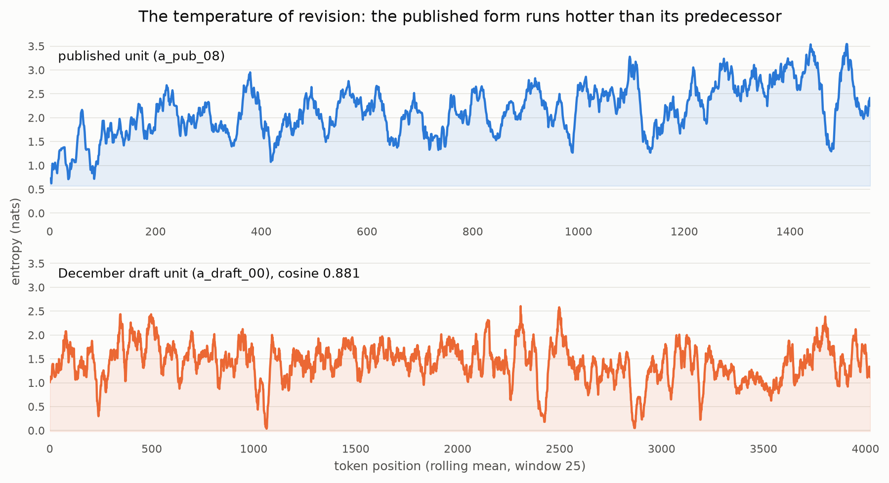

# AN2B Labs Technical Report #011
## Semantic Thermodynamics: Entropy Stylometry Reads Identity, Not Craft, and the Author-Identity Control That Proves It

**J. DeVere Cooley, AN2B Labs**
**Status: v1.0, published 2026-08-31; ledger at an2b.com/labs**
**Pre-registration: commit `7b7262d`, 2026-08-24, github.com/jcools1977/an2b-labs**

---

## Abstract

TR-011 asked whether polished published prose carries characteristic
token-entropy signatures, measured through language models as
thermometers, stable enough to serve as an editing instrument. The
verdict is **FAIL**, and the manner of the failure is the report's
contribution. A classifier on six entropy-series features separated
published prose from unpublished drafts at **AUC 1.00**, the kind of
number that leads press releases. A control pre-registered three days
before that number existed then confiscated it: the identical pipeline,
trained to separate this author's published prose from other authors'
published prose (two classes of PUBLISHED text), scored **AUC 0.96**.
The classifier never learned polish; it learned who is writing about
what, and when. Two further pre-registered controls located the
mechanism: destroying all sentence order moved the nominally sequential
features by 0.00 and 0.09 against a 0.30 gate (they are bags of words
wearing sequence-shaped names), and a topic probe predicted semantic
clusters from the entropy features at 0.67-0.85 accuracy against 0.42
chance. One feature survived everything: entropy variance, higher in
published text across the paired draft lineage (n=3, a demonstration,
not an inference), same direction in the broader corpus, cross-model
Spearman rho 0.87, one qualifying feature where the frozen gate
demanded two. Every entropy-based "writing quality detector" now has a
pair of controls it must survive, and a sealed pipeline to survive them
in. Everything ran on one 16 GB Mac mini at $0.

## 1. Hypothesis

**H1:** published prose shows (a) lower mean per-token entropy,
(b) higher entropy-variance structure, and (c) characteristic
autocorrelation length, versus earlier drafts of the same work and
versus unpublished prose, with effect sizes stable across two scoring
models. **H0:** the signatures are indistinguishable once confounds are
controlled. The frozen gates: at least two features at |paired Cliff's
delta| >= 0.3 with cross-corpus sign agreement and cross-model rho >=
0.7; author-disjoint AUC >= 0.7; KILL if the signal is a sentence-length
detector.

## 2. Method

Thresholds pre-registered in the program's root commit; twenty-one
implementation decisions (D1-D21) each committed before the number it
could have bent toward, including: the six features with their exact
definitions; a **data covenant** governing the author's manuscript
archive (read-only input, hashes and statistics only, no qualitative
characterization of draft content, drafts as seeds); a **blind pairing
rule** (draft-to-published alignment by embeddings that never touch the
scoring models, threshold frozen at cosine 0.60, no-ancestor sections
excluded); a **memorization audit** with response ladder, run
structurally before any feature; the **author-identity control** with
its 0.7 confiscation rule; and the n=3 demonstration reading, frozen
while the pair count was still 4.

Corpora: (A) the published book (55 sections plus its Light Papers,
29,790 words) paired blind against its earliest substantial draft
generation (December 2024); (B) 20 canonical public-domain novels
(distinct authors), 17 units of this author's published prose on the
published side (so author identity spans both classes), and 20
unpublished chapters of a different in-progress book as slush. Scoring:
two cross-family pinned models (Qwen3-1.7B, Llama-3.1-8B, both 4-bit),
full-vocabulary softmax entropy plus NLL, window 2048, stride 1024,
minimum context 1024, every series byte-reproducible and duplicates
re-scoring byte-identically.

## 3. The audit that ran first

The memorization audit (20 seeded prefixes per document, greedy
continuation, exact-token-match) ran before any feature existed, by
structural refusal in the runner. Result: group gap 0.0025 against a
0.05 scoping rule; zero exclusions; the most-memorized document in the
corpus was *Alice in Wonderland* at 0.175 against a 0.5 threshold.
**Desk-scale 4-bit models do not verbatim-recall even the canon**, and
the near-uniform ~0.06 baseline across text the models provably never
saw shows the probe reads generic predictability. Corpus B entered
analysis with full standing; what invalidated it later was not
memorization. (Limitation, pre-registered: exact-match probes can
underestimate soft memorization; the cross-model gate and the
author-identity control are partial guards.)

## 4. Results: the confiscation

| Gate | Frozen requirement | Measured | Leg |
|---|---|---|---|
| Corpus-B classifier | AUC >= 0.7, author-disjoint | **1.000** | confiscated |
| Author-identity control | < 0.7 or corpus B is scoped out | **0.962** | **red** |
| Qualifying features | >= 2 (delta, sign, rho) | **1** (variance) | **red** |
| Shuffle control | sequential features move >= 0.3 | 0.00 / 0.09 | **red** |
| Topic control | accuracy CI includes chance | [0.67, 0.85] vs 0.42 | **red** |
| Duplicates control | byte-identical | byte-identical | green |
| KILL (length detector) | must not be the explanation | did not fire | green |

The centerpiece: a perfect published-versus-slush separation, unmasked
as a stylometer by the control built for exactly that unmasking.
DeVere-published versus Gutenberg-published, all documents published,
differing in author and era, separates at 0.96 from the same six
features. The AUC of 1.00 is therefore an identity measurement wearing
a quality costume, and the pre-registered rule confiscated it without a
judgment call. The shuffle control shows why: the features barely
notice when all sequential structure is destroyed, so the "temperature
profile" was reading vocabulary and register, not rhythm. The
autocorrelation feature degenerated to a constant on one model and
self-disqualified under the frozen conservative rule.

**The surviving thread.** Entropy variance qualified in full: higher in
the published form in all three surviving lineage pairs (paired Cliff's
delta +1.0 at n=3, stated per the frozen demonstration reading), the
same direction across the broader corpus, cross-model rho 0.87. One
feature; the gate demanded two; the gate stands.

**The book's own numbers, stated as the covenant permits.** Across the
three surviving pairs of the same work at two stages: mean entropy
higher in the published form (+1.0), variance higher (+1.0), spike rate
lower (-1.0), both models agreeing where it counts. The hypothesis
predicted revision would cool the prose toward predictability. The
measured direction is the opposite: the published form runs hotter and
more varied than its December predecessor, with fewer extreme spikes
relative to its own level, sustained heat rather than jolts (Figure 1).
Numbers about entropy series; the drafts remain seeds.

*Figure 1. The entropy-trace visualizer on the highest-cosine surviving
lineage pair (Llama thermometer, rolling mean 25). The published unit
runs visibly hotter than the December draft unit. The strips are the
protocol's deliverable regardless of verdict, now honestly labeled: a
texture instrument, not a quality detector.*

## 5. Findings

1. **The author-identity control is mandatory equipment** for any
   prose-signature claim. Train the same pipeline on same-class text
   differing only in author; if it scores high, the headline number is
   identity, not quality. The field currently publishes without this
   control; TR-011 supplies it with receipts and a sealed pipeline.
2. **These six entropy-series features are bags of words in sequence
   costume.** Sentence-shuffle invariance is a one-line control and
   these features fail it; any claimed "rhythm" or "profile" result
   must show its shuffle delta.
3. **Desk-scale acquittal:** 4-bit 1.7B and 8B models do not verbatim-
   recall canonical public-domain text (max 0.175 exact-match); future
   desk-scale studies may cite this instead of assuming contamination.

## 6. Verdict

**FAIL**, per the frozen criteria: features unstable across scoring
models (four of six disqualified by rho or degeneracy), fewer than two
qualifying features, and the corpus-B AUC invalidated by the
pre-registered author-identity rule. The KILL did not fire: the signal
that failed was not a length artifact; it was an identity artifact,
which is the more instructive death. The final verify runs the
instrument legs green (corpora integrity, audit ordering, duplicates
determinism, certified residualizer) and the gate and control legs red
for measured reasons. Nothing moved.

## 7. Limitations

- Corpus A survives as n=3 paired demonstrations: the published book
  is three-quarters new relative to its December predecessor (13 of 17
  published units have no ancestor at the frozen alignment threshold),
  itself a reportable measure of how far the work traveled.
- The author-identity control conflates author, era, and register:
  contemporary prose versus nineteenth-century prose. It does not need
  to separate them to do its job (any of the three is not-craft), but
  finer attribution is future work.
- Slush is single-author; corpus B's folds handle the bilateral author
  per D21, and the confiscation renders the residual question moot.
- The V1-V6 and spring-2025 generational trend remains inside the
  exploratory fence (D13), deferred, never run against the gate.
- One quantization ruler (4-bit), two model families, one language.

## 8. Reproducibility

Public repository: github.com/jcools1977/an2b-labs, `tr011/`. The
decision log runs D1-D21; the corpus manifest carries hashes, the
blind pairing with cosines, yield, folds, and backups; per-document
features, all four gate files, and `verify.sh` are committed. The
manuscript corpus itself never enters the repository, per the data
covenant, and this report characterizes it only as numbers. Hardware:
one Apple M4 Mac mini, 16 GB. Incremental cost: $0. Wall-clock: one
attended day from corpus assembly to verdict.
