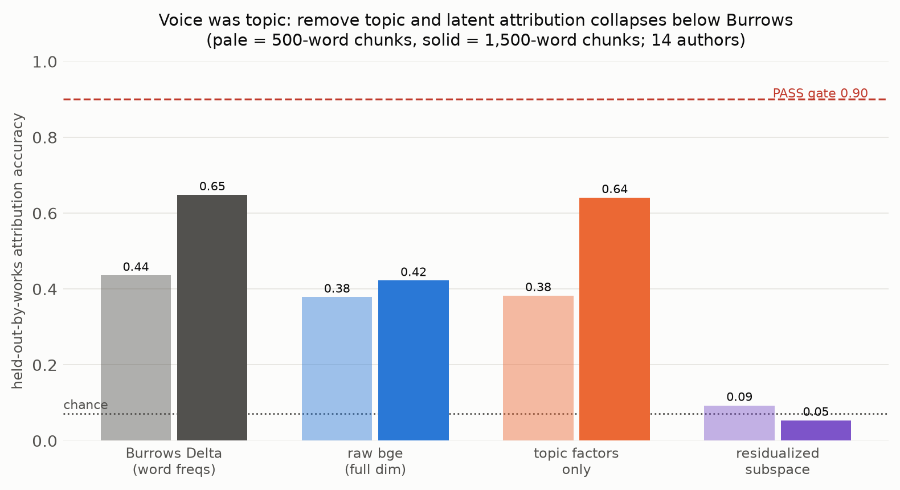
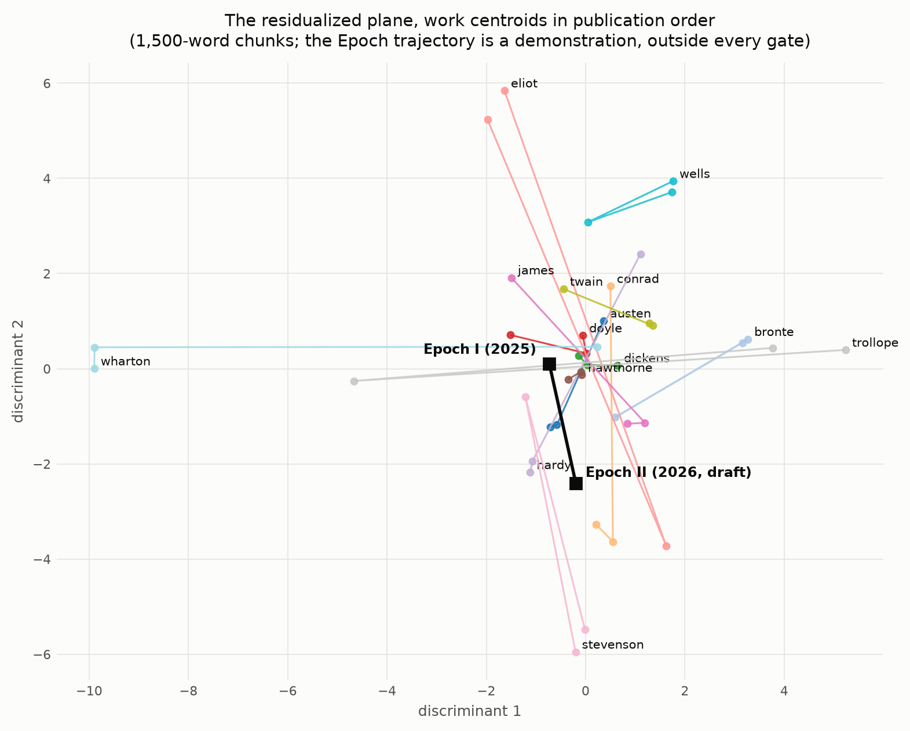

# AN2B Labs Technical Report #015
## Burrows Delta in Latent Space: No Voice Manifold Survives Topic Removal

**J. DeVere Cooley, AN2B Labs**
**Status: DRAFT v0.1, 2026-08-31; awaiting reviewer adjudication and PI ratification**
**Pre-registration: commit `7b7262d`, 2026-08-24, github.com/jcools1977/an2b-labs**

---

## Abstract

TR-015 asked whether authorial voice occupies a stable low-dimensional
manifold in embedding space once topic is projected out. The verdict is
**FAIL**, in the exact shape the protocol's H0 pre-registered: voice
was topic. On 14 authors x 3 works held out by whole works, raw
bge-small embeddings attribute authors at 0.38-0.42; a classifier on
the 20 LDA topic factors ALONE reaches 0.64, exceeding the raw
embeddings; and after the certified residualizer removes those factors,
low-rank attribution collapses to 0.05-0.09 against a 0.90 gate and a
0.071 chance floor. Classical Burrows Delta on a frozen word list wins
at 0.44-0.65, firing the protocol's "embeddings add nothing" FAIL
clause. The drift gate followed: 0 of 14 authors show within-author
drift smaller than half the between-author distance with consistent
direction, because once topic is gone there is no stable geometry left
to drift within. A non-gated replication with a second embedder
(e5-small-v2) reproduces every number in direction. The result hands
desk-scale stylometry a clean negative: in small sentence-embedding
spaces, "voice" as measured by attribution is overwhelmingly a
vocabulary-and-subject signature, and the fashionable residualization
step does not rescue a voice signal, it reveals there was not one.
Everything ran on two Apple Silicon machines at $0.

## 1. Hypothesis

**H1:** author identity is linearly recoverable from a rank <= 10
subspace of chunk embeddings at >= 90% held-out accuracy after topic
residualization, beating or matching Burrows Delta, with drift ratio
< 0.5 for >= 80% of authors and drift direction consistent across
chunk sizes. **H0:** apparent voice signal is topic and period
residue; after residualization authors are not separable in low rank,
and Burrows Delta is not improved upon. KILL: content-preserving
paraphrases landing in other authors' regions unmask the subspace as
content.

## 2. Method

Thresholds frozen in the program's root commit; nineteen decisions
(D1-D19) logged before the numbers each could have bent. Corpus: 14
canonical authors (Austen through Hawthorne), 3 works each in
publication order, 3,700 chunks at 500 and 1,500 words (both sizes
gated, D4), split by WHOLE WORKS (D3): every test chunk comes from a
work absent from training, one frozen seed-41 assignment consumed by
every instrument (D17). Translated authors excluded at the door (D11);
two translators of the same Verne novel and two Tolstoy novels under
different translators enter only as control 3. The author's own Epoch
material enters under fresh consent (D1), flagged out of the gate
population at the registry level (D14): the gate arithmetic is the
Gutenberg set exactly.

Pipeline: bge-small-en-v1.5, 400-token windows mean-pooled per chunk
(D2); LDA k=20 seed 37 topic factors (D5); OLS residualization
certified by a bite-proof exam before real data touched it (D6:
planted topic-only signal must collapse to chance, planted orthogonal
voice signal must survive at >= 80% margin — both held); voice
subspace by linear discriminant projection, smallest rank <= 10
clearing the gate; Burrows Delta on a frozen 150-word list committed
before any accuracy existed (D7, with D15's honesty note: the list is
high-frequency, not purist, and its topic leakage only strengthens the
baseline the embeddings must beat). e5-small-v2 runs the identical
procedure as a non-gated replication that cannot touch gate files
(D18).

## 3. Results: voice was topic

| Instrument | 500-word | 1,500-word |
|---|---|---|
| Burrows Delta (frozen word list) | 0.436 | **0.648** |
| Raw bge, full 384 dims | 0.379 | 0.422 |
| Topic factors alone (20 dims) | 0.382 | **0.641** |
| Residualized, rank-10 subspace | 0.093 | 0.054 |
| Chance (14 authors) | 0.071 | 0.071 |

The table is the argument. The 20 topic proportions carry MORE
attribution signal than the full 384-dimensional embedding they were
extracted from; remove them and what remains attributes at chance.
The protocol's control-2 language, frozen in D9, reads itself out
loud: residualized rank <= 10 accuracy misses the gate while
topic-only approaches (here exceeds) full-dimensional accuracy, so
"the FAIL reads: voice was topic." Burrows Delta beats the latent
instrument at both sizes, firing the second FAIL clause. The e5
replication reproduces the collapse (0.057 residualized minimum,
identical gate outcomes).

**Drift: nothing left to drift.** In the residualized subspace,
consecutive-work steps run 0.34-3.05x the mean between-author distance
(gate: < 0.5), and cross-size drift-direction cosines scatter in
[-0.33, +0.57] around zero. 0 of 14 authors satisfy D10. Figure 2
shows the plane honestly: work centroids leap across the map, because
the map is measuring what topic removal left behind, which is mostly
noise.

*Figure 1. The four instruments at both chunk sizes. Topic factors
alone (orange) beat the raw embeddings; the residualized subspace
(purple) sits at chance; the gate sits at 0.90, unreachable.*

*Figure 2. The residualized discriminant plane, work centroids joined
in publication order. The Epoch I -> II trajectory (black) is drawn as
coordinates only, per D12 and D14: a demonstration, outside every
gate; its step measures 1.3-1.8x the mean between-author distance at
n = (40, 19) chunks per endpoint at 1,500 words.*

## 4. Controls

- **Label shuffle (control 1): red at one size, and reported as such.**
  The shuffled-label CI at 1,500 words includes chance ([0.056,
  0.102] vs 0.071); at 500 words it narrowly excludes it ([0.077,
  0.125]). Per D19 the gate consumed the stricter size and the
  checker records the violation. The likely mechanism is benign
  (chunks cluster by work, so a single-permutation bootstrap over
  chunks understates variance), but the pre-registered reading stands:
  a pipeline caveat, disclosed, adjudication surfaced to the PI and
  reviewer rather than repaired after the fact.
- **Topic-only classifier (control 2):** 0.382 / 0.641 — the leak the
  residualization was built to close, and the headline of the FAIL.
- **Translation stress (control 3, reported never gated):** with the
  subspace holding almost nothing, translator geometry is noise-level:
  the same Verne novel under two translators lands at cosine 0.481 at
  both sizes; two Tolstoy novels under different translators swing
  from +0.778 (500) to -0.116 (1,500), against a same-author baseline
  of 0.054-0.299. No graceful degradation claim is possible in a
  collapsed space; reported for completeness.

## 5. The KILL

[PENDING: D8 paraphrase run on legion — 100 seed-41 chunks from
held-out test works, pinned Llama-3.1-8B rewrites under TR-011 D14
bounds, attribution in the voice subspace vs 2x chance. Note for the
reading: original unparaphrased subspace attribution (0.093) is
already below 2x chance (0.143), so the KILL can only fire trivially —
the same death by another door, not an independent wound.]

## 6. Findings

1. **Topic factors out-attribute the embeddings they came from.**
   Twenty LDA dimensions beat 384 embedding dimensions at authorship.
   Any attribution paper using small sentence embedders should report
   this one-line control before claiming a voice representation.
2. **Residualization is a revealer, not a rescuer.** The certified
   projector (planted-signal exam on both failure sides) removed topic
   and found nothing underneath. When a stylometry pipeline's accuracy
   survives residualization, that is evidence of voice; TR-015 shows
   the honest instrument reporting the opposite outcome.
3. **Burrows Delta remains the desk-scale champion.** A frozen
   150-word frequency list beats a modern embedder at held-out-by-work
   attribution. Sixty years on, the baseline still wins when the test
   is honest (whole works held out, topic controlled).
4. **TR-011's confound, now measured from the other side.** TR-011
   showed an entropy "quality" signal was identity; TR-015 shows the
   identity signal itself is, in embedding space, largely topic. The
   pair bounds what desk-scale latent stylometry can honestly claim.

## 7. Verdict

**FAIL**, per the frozen criteria, in the pre-registered H0 shape:
residualization destroys separability (voice was topic) AND Burrows
Delta wins. The drift gate misses at 0 of 14 authors. [KILL status
pending the paraphrase run; the FAIL stands regardless.] The verify
suite runs instrument legs green (checker self-tests, residualizer
bite-proof, corpus integrity) and gate legs red for measured reasons.
Nothing moved after the cold read except D19's strictness correction,
logged and surfaced.

## 8. Limitations

- One embedder family carries the gates (bge-small; e5-small-v2
  replicates). Larger or instruction-tuned embedders might carry
  voice signal these 384-dim models do not; the FAIL is desk-scale.
- LDA k=20 on within-corpus text makes topics partially collinear
  with author identity by construction; the protocol chose that
  confrontation deliberately, and control 2 measures it rather than
  hiding it.
- The label-shuffle CI's clustering caveat (D19) applies to the
  control's variance estimate, not to any gate number.
- The Epoch trajectory is a two-point demonstration at n = (40, 19)
  chunks, coordinates only, no craft claims (D12, D14, covenant D1).

## 9. Reproducibility

Public repository: github.com/jcools1977/an2b-labs, `tr015/`.
Decision log D1-D19; corpus manifest with per-chunk hashes; embedding
sidecar hashes; all gate files; verify.sh. Gutenberg texts are
re-downloadable by ID from the committed builder; the Epoch corpus
never enters the repository (D1). Hardware: one M-series laptop, one
16 GB Mac mini. Incremental cost: $0. Wall-clock: one attended day
from corpus to cold gates.
